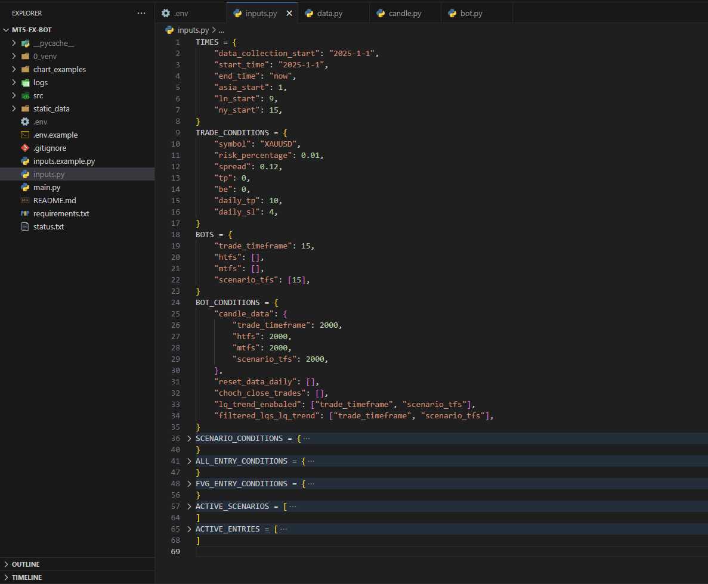
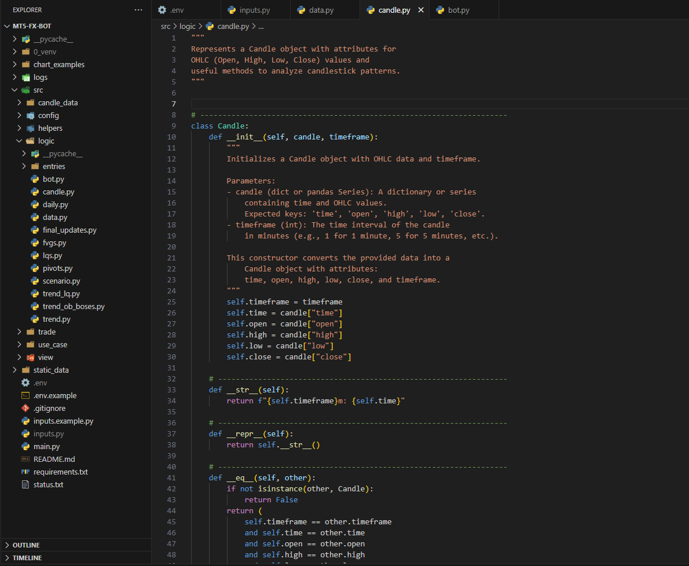

## 🛠️ My Projects

| Project Name       | Tech Stack                  | Description                                   |
|-----------------|------------------------|--------------------------------|
| CustomTradeBot | Python, MetaTrader5, Plotly | CustomTradeBot is a trading bot designed for live trading and backtesting with MetaTrader5 integration. It executes trades based on a custom strategy using dynamic features like entry conditions, custom objects (e.g., FVG, pivot, trend), and flexible order handling. The bot’s core is powered by pure Python with advanced exception handling and real-time control via a status file.[Screenshots](#customtradebot-screenshots) |
| DjangoOnlineShop | Django, MySQL, AJAX | E-commerce platform with recursive category handling, OTP-based login, and smooth UX using AJAX. [Screenshots](#django-online-shop-screenshots) |
| DRFOnlineShop | Django Rest Framework | Backend for future e-commerce projects with CRUD operations and OTP authentication. [Screenshots](#drf-online-shop-screenshots) |
| PropTraderAssistant | Python, MT5 | Parses MT5 trade history HTML to calculate the 80% rule and scalp rule. [Screenshots](#prop-trader-assistant-screenshots) |

---

### 📸 CustomTradeBot Screenshots

### 📸 Django Online Shop Screenshots

### 📸 DRF Online Shop Screenshots

### 📸 Prop Trader Assistant Screenshots

